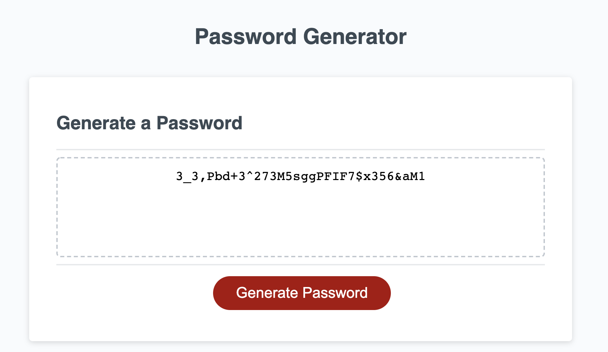

# PasswordGenerator

## Description

The purpose of this project is to create a password generator application which takes in criteria from a user (i.e. password length, types of characters to be used) and generates a password.

This project gives a taste of what you can do with a little javascript added to a webpage.  It demonstrates how to take input from a user and produce dynamic results given the user's criteria.

## Learning Highlights from the Code
👂 Event listeners to perform an action when the user clicks the Generate Password button

👜 Arrays to store values 

❕ Prompts and alerts to get information from the user and also to provide the user with feedback

✨ A combination of if/else statements and a for loop to verify the user's input and piece together a valid password
## Sample Password Generator Results

## Check it out!
👉 [Link to the Application](https://mel-ificent.github.io/PasswordGenerator/)